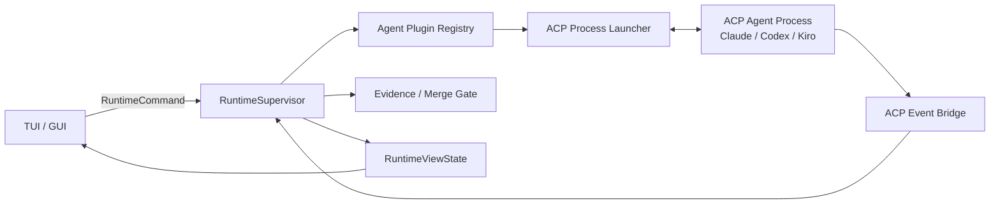

# Zed ACP 接入研究

英文版：[zed-acp-integration-research.md](zed-acp-integration-research.md)

状态：设计研究，按 2026-07-07 当前资料整理。

## 目的

这份文档明确 Zed 当前如何通过 ACP 接入外部 agent，ACP 生态接下来的实现方向，以及
Viden 应该如何设计第一批可用的 Claude、Codex、Kiro CLI 适配器，同时避免把能力绑死在
TUI 或 GUI 实现里。

## 主要资料来源

- Zed External Agents 文档：
  <https://zed.dev/docs/ai/external-agents>
- ACP architecture 与 protocol v1：
  <https://raw.githubusercontent.com/agentclientprotocol/agent-client-protocol/main/docs/get-started/architecture.mdx>
  和
  <https://raw.githubusercontent.com/agentclientprotocol/agent-client-protocol/main/docs/protocol/v1/overview.mdx>
- ACP registry 文档与当前 registry 数据：
  <https://raw.githubusercontent.com/agentclientprotocol/agent-client-protocol/main/docs/get-started/registry.mdx>
  和 <https://cdn.agentclientprotocol.com/registry/v1/latest/registry.json>
- ACP v2 RFD：
  <https://raw.githubusercontent.com/agentclientprotocol/agent-client-protocol/main/docs/rfds/v2/overview.mdx>
- ACP proxy-chain RFD：
  <https://raw.githubusercontent.com/agentclientprotocol/agent-client-protocol/main/docs/rfds/proxy-chains.mdx>
- 已检查的 Zed 源码路径：
  `crates/agent_servers/src/agent_servers.rs`、
  `crates/agent_servers/src/acp.rs`、
  `crates/agent_servers/src/custom.rs`、
  `crates/acp_thread/src/connection.rs`、
  `crates/acp_thread/src/acp_thread.rs`、
  `crates/project/src/agent_server_store.rs`、
  `crates/project/src/agent_registry_store.rs`、
  `crates/settings_ui/src/pages/external_agents_page.rs`。
- Kiro CLI 官方 ACP 文档：
  <https://kiro.dev/docs/cli/acp/>。

## Zed 当前路径

Zed 把 ACP agent 当成外部进程。Zed 负责 thread UI 和 thread history；外部 agent
通常拥有自己的 runtime、auth、model selection、provider billing、tools 和 native
configuration。

当前 Zed 产品路径是：

1. 常见 agent 从 ACP Registry 安装。
2. 不在 registry 里的 agent 通过 `agent_servers` settings 作为 custom ACP agent 添加。
3. 在 Agent Panel 或 Threads Sidebar 中启动 external-agent thread。
4. 通过 stdin/stdout JSON-RPC 连接 agent 子进程。
5. 转发 session prompt，并接收实时 `session/update` notifications。
6. agent 通过 ACP 向编辑器请求 permission、file access、terminal actions 和其他 client capabilities。
7. 通过 ACP logs 调试 wire protocol。

关键产品边界：Zed 明确说明 extension-provided agents 已经废弃。ACP Registry 是现在的主要安装路径，
旧 extension agent 会在可能时迁移到 registry 对应项。

## Zed 代码形态

Zed 的实现有清晰的三层分工。Viden 应该保留这个思想，但不复制 GPUI 内部模型：

| Zed 区域 | 负责 | Viden 对应 |
| --- | --- | --- |
| `agent_servers` | 注册外部 agent，解析 registry/custom command spec，注入环境变量，连接子进程。 | `plugin-host` 加 external-agent registry 和 process launcher。 |
| `acp_thread` | 定义 `AgentConnection`、session lifecycle、auth、prompt/cancel、model selector、session config、elicitation、tool call、diff、terminal、debug event。 | runtime 拥有的 external-agent connection 层，输出 `RuntimeEvent`、接收 `RuntimeCommand`。 |
| `agent_ui` / settings UI | 渲染 external agents、配置、registry install、model/config selector、thread view 和 ACP logs。 | TUI/GUI 订阅 `RuntimeViewState`，不直接连接 ACP 子进程。 |
| `AgentRegistryStore` | 拉取 registry 数据，归一化 binary/NPX distribution，缓存 metadata、icon、version。 | Viden registry reader，生成 plugin manifest 和 install/update status。 |
| `AgentServerStore` | 管理已安装 external-agent entries、custom-vs-registry source、legacy extension 到 registry 的迁移、command resolution。 | Viden agent plugin registry，支持 custom/local/registry source。 |

关键 Zed trait 边界：

- `AgentServer` 把已安装 agent 连接成 `AgentConnection`。
- `ExternalAgentServer` 解析 executable command、args、env。
- `AgentConnection` 拥有 `new_session`、`load_session`、`resume_session`、
  `close_session`、`auth_methods`、`authenticate`、`logout`、`prompt`、`cancel`、
  `model_selector`、`session_modes`、`session_config_options`、`session_list`。

Viden 应该复用 capability 边界，而不是复用具体 trait 命名或 GPUI entity 模型。

## 首先要支持的 ACP v1 契约

ACP v1 是基于 subprocess transport 的 JSON-RPC 2.0。Agent 侧 baseline methods：

- `initialize`
- `authenticate`
- `session/new`
- `session/prompt`

常见 optional methods：

- `session/load`
- `logout`
- `session/set_mode`
- agent 暴露模型切换时支持 `session/set_model`
- `session/cancel`

Client 侧 methods 与 notifications：

- `session/request_permission`
- `fs/read_text_file`
- `fs/write_text_file`
- `terminal/create`
- `terminal/output`
- `terminal/release`
- `terminal/wait_for_exit`
- `terminal/kill`
- `session/update`

`session/update` 是 UI 和 runtime facts 的主要流式入口，可以承载 message chunks、tool calls、
plans、advertised commands 和 mode changes。ACP 路径必须是绝对路径，行号从 1 开始。

## ACP 未来路径

ACP v2 正在推进，而且是刻意的 breaking change。Viden 的 adapter 设计必须允许 v1/v2
共存在一个版本化协议层后面。

对 Viden 重要的变化：

- dedicated session modes 会被移除，改用 session config options。
- model-like state 也应该通过 session config options 表达。
- v2 会从核心协议中移除 v1 client filesystem 和 terminal execution surface；
  terminal authentication 仍然保留为独立能力。
- tool call 变成按 tool-call id upsert 的 update。
- tool-call content 可以分块流式追加。
- diff 方向变成可渲染 git patch 加结构化 file operations。
- permission request 要有必填 title，并可以带结构化 subject。
- message chunks 需要 message id，同时支持 whole-message upsert。
- 当 agent 声明 session capability 时，baseline session support 要包含
  `session/new`、`session/list`、`session/resume`、`session/close`、
  `session/prompt`、`session/cancel`、`session/update`。
- 初始化 capability fields 会归并到统一 `capabilities` shape。

proxy-chain RFD 对 Viden 后续插件架构也很重要。它提出一个 conductor 位于 client、
proxies 和最终 agent 之间。这个方向适合 Viden 后续把 context injection、tool policy、
response filtering 和 multi-agent coordination 做成可复用 extension。

## 第一批 Agent 目标

| Agent | 当前最佳路径 | 说明 |
| --- | --- | --- |
| Claude | 当前 registry 数据中的 ACP Registry package `@agentclientprotocol/claude-agent-acp@0.56.0`。 | agent 拥有 auth/billing/model 行为。Viden 不能假设 Viden 的 Anthropic provider key 配置会自动作用于它。 |
| Codex | 当前 registry 数据中的 ACP Registry package `@agentclientprotocol/codex-acp@1.1.0`。 | agent 拥有 Codex/OpenAI auth 和 native config。Viden 仍要传递安全 proxy/env，并把权限接入 runtime。 |
| Kiro CLI | 官方 local ACP command `kiro-cli acp`；同时支持通过 `kiro-cli acp --agent <name>` 选择 agent configuration。 | Kiro 官方支持基于 stdio JSON-RPC 的 ACP，并给出 Zed custom-agent 配置方式。当前 ACP Registry 数据没有 Kiro 条目，因此 Viden 首版应作为 local-command agent source 支持；后续若 registry metadata 出现，再切到 registry source。 |

## Kiro 专属 Adapter 要求

Kiro CLI 不是不确定的 generic CLI 路径。官方文档明确它实现 ACP，并可以这样启动：

```bash
kiro-cli acp
kiro-cli acp --agent my-agent
kiro-cli acp --model <model-id>
kiro-cli acp --effort high
kiro-cli acp --trust-tools fs/read_text_file,terminal/create
kiro-cli acp --trust-all-tools
kiro-cli acp --agent-engine v3
```

Kiro 进程通过 stdin/stdout 使用 JSON-RPC 2.0 通信。官方列出的 core methods 包括：

- `initialize`；
- `session/new`；
- `session/load`；
- `session/prompt`；
- `session/cancel`；
- `session/set_mode`；
- `session/set_model`。

Kiro 初始化时会声明 `loadSession: true` 和 image prompt capability。它会通过 session
updates 流式发送 `AgentMessageChunk`、`ToolCall`、`ToolCallUpdate` 和 `TurnEnd`。

Kiro 公共文档里的 `session/prompt` 请求使用 `content` array，但 Kiro CLI 2.10.0
当前会拒绝该 shape，并报 `missing field prompt`。因此 Viden 以真实 wire behavior
为准：Kiro、Codex、Claude 都发送 `prompt` array；未来如果某个 descriptor 明确声明
content-array compatibility capability，再单独启用。

Kiro 还提供实验性的 `_kiro.dev/*` 扩展。Viden 应把这些当成 adapter feature flag
后面的可选能力，而不是 baseline ACP 要求：

- `_kiro.dev/commands/available`、`_kiro.dev/commands/options`、
  `_kiro.dev/commands/execute`：slash-command 发现、补全和执行；
- `_kiro.dev/mcp/oauth_request`、`_kiro.dev/mcp/server_initialized`：MCP server events；
- `_kiro.dev/compaction/status`、`_kiro.dev/clear/status`、`_session/terminate`：
  session lifecycle 和 subagent signals。

对 Viden 的影响：

- `session/set_model` 必须作为 agent-session config operation 建模，不能当作 Viden
  provider/model switch。
- `VIDEN_KIRO_AGENT=<name>` 选择官方 `kiro-cli acp --agent <name>` 路径，用于
  local smoke 和 operator-specific Kiro 配置。
- `VIDEN_KIRO_MODEL`、`VIDEN_KIRO_EFFORT`、`VIDEN_KIRO_TRUST_TOOLS`、
  `VIDEN_KIRO_TRUST_ALL_TOOLS` 和 `VIDEN_KIRO_AGENT_ENGINE` 映射到 Kiro 官方
  ACP launch flags。`VIDEN_KIRO_TRUST_ALL_TOOLS=true` 优先于
  `VIDEN_KIRO_TRUST_TOOLS`，避免 Viden 同时发送两套 trust strategy。
- `/agent auth acp kiro-cli` 应该是 native-login guide，而不是 ACP
  `authenticate` 调用，因为 Kiro 在 Viden 外部拥有 credentials 和 login state。
  预期 operator 路径是 `kiro-cli login --use-device-flow`、`kiro-cli doctor`，
  然后 `/agent smoke acp --live`。
- Kiro slash-command 支持应通过 ACP extension capability 进入，同时仍然发出正常
  `RuntimeEvent` 和 evidence records。
- Kiro MCP events 应进入 runtime logs 和 UI state，但 MCP credentials 与 OAuth prompts
  仍必须通过 Viden permission/auth 边界。
- Kiro session files 属于 Kiro 自己的 session storage。Viden 应在 transcript 中记录
  ACP session id 和 log references，但不能把 Kiro native history 说成 Viden-owned
  durable history。

## Viden 设计决策

Viden 应该把外部 agent 做成 plugin/extension，但实际运行路径必须由 core 拥有：



核心规则：

- UI app 不能直接 spawn 或解析 ACP agent。
- Agent plugin 声明 capability、auth mode、command source、permission、支持的 protocol version 和 evidence 行为。
- Runtime 拥有 `session/new`、`session/prompt`、cancellation、permission request、
  evidence conversion、transcript entries 和 merge-gate updates。
- 外部 agent 不能通过 side channel 修改文件。ACP file、terminal、tool、permission
  requests 必须转换为 Viden runtime tool requests，或者被策略拒绝。
- Claude/Codex/Kiro 配置在 agent 拥有 auth/provider routing 时保持 agent-native。
  Viden 只存 launch configuration、defaults 和安全的环境变量引用。
- ACP logs 是一等 debug evidence，必须能在 TUI/GUI 中查看。

## 实施计划

### 当前 Foundation 落地点

第一刀 core slice 已经作为共享 runtime 基础设施落地，而不是 TUI command glue：

- `plugin-api` 定义 `AgentPluginDescriptor`，覆盖 source、transport、auth、
  capability、protocol-version、command 和 permission-profile 契约。
- `plugin-host` 内置 `claude-acp`、`codex-acp` 和 `kiro-cli` 三个 ACP descriptor。
- `runtime` 通过 `/agent list` 和 `/agent doctor <id>` 展示这些 descriptor。
- `runtime` 可以通过 `/agent probe acp <agent-id>` 按 descriptor command 跑 ACP
  `initialize` probe，并写出 JSONL wire evidence。
- `runtime` 可以通过 `/agent run acp <agent-id> <task>` 运行最小
  descriptor-backed ACP session，覆盖 `session/new`、`session/prompt`、
  streamed `session/update` 和 TurnEnd collection。
- `runtime` 可以通过 `/agent run acp --load-session <session-id> <agent-id>
  <task>` 对已有 agent session 继续发送任务。同一条路径支持用 `--mode
  <mode-id>` 发送 `session/set_mode`，以及用 `--model <model-id>` 通过 ACP
  `session/set_config_option` 写入 `model` config；legacy `session/set_model`
  已保留为兼容 request builder。
- `runtime` 可以通过 `/agent run acp --async <agent-id> <task>` 启动后台
  descriptor-backed ACP session，把它记录为 tracked agent job，写出 JSONL/result
  artifacts，持久化已投影的 runtime events，并通过 `/agent cancel <id>` 停止。
- ACP 后台取消现在会在 live ACP session 可用时优先请求协议层
  `session/cancel`，把请求写入 wire log；如果外部 agent 没有及时停止，再使用有界
  process termination 作为 fallback。
- `runtime` 已把 ACP `session/request_permission` 转换为 Viden
  `PermissionPrompt` approval，并按 allow/reject 结果回写选中的 ACP option。
- `runtime` 已把 tracked ACP session jobs 投影到 `RuntimeViewState`，作为
  `AgentTask` records 暴露，所以 TUI/GUI 可以通过和一方 runtime task 相同的状态流消费。
- `runtime` 已把 ACP `session/update` / `session/notification` payloads 投影成
  可复用 `RuntimeEvent` records，覆盖 assistant delta、tool call start/finish
  和 turn-end evidence。
- 后台 ACP session job 会在 updates 到达时持续把投影事件追加到
  `runtime-events.jsonl`，`RuntimeViewState` 会重放这些事件，因此 TUI/GUI 可以通过
  和同步任务相同的 runtime-state 路径展示 ACP assistant output、tool evidence 和
  turn-end evidence。
- 后台 ACP session job 也会在 updates 到达时把投影事件直接推送进 live
  `RuntimeSupervisor` event stream，因此 TUI/GUI 可以在 result artifact 完成前渲染
  assistant delta。
- `runtime` 已把 ACP `fs/read_text_file` 和 `fs/write_text_file` 通过 Viden
  permission checks 桥接。
- `runtime` 已把 ACP `terminal/create`、`terminal/input`、
  `terminal/write`、`terminal/output`、`terminal/wait_for_exit`、
  `terminal/release` 和 `terminal/kill` 通过 Viden permission checks 桥接。
  `terminal/create` 会启动 tracked process 而不是等待退出，`terminal/input`
  / `terminal/write` 会写入该 process stdin，`terminal/output` 会轮询
  buffered stdout/stderr，`terminal/wait_for_exit` / `terminal/kill` 会更新
  long-running command 的 process status。未支持的 filesystem 或 terminal
  methods 仍会返回明确 JSON-RPC error，并留下 wire-log evidence。
- descriptor-backed ACP handshake 对 registry package 使用比 local command 更长的
  startup timeout，因为 `npx` cold-start installation 本身就是 readiness 的一部分。
- `/agent doctor kiro-cli` 会把 Kiro 标为 `installed; auth unknown`，并提示 operator
  运行 `kiro-cli login` / `kiro-cli doctor`；binary 存在不等于 ACP session 可运行。
- TUI agent-task projection 已能区分 `acp-session` job 和 Codex job，ACP job
  会显示为 ACP transport，而不是 Codex app-server work。
- ACP session output 已映射到 merge-gate records。每个 ACP session 会提出
  session merge gate，completed tool updates 会成为 `tool_log` evidence，
  `TurnEnd` 会成为 `acp_turn_end` evidence，并在 turn-end evidence 存在后把
  gate 推到 `Accepted`。
- ACP patch/diff updates 现在会在 update 通过 `diff`、`patch`、
  `unifiedDiff` 或嵌套 file-change payload 字段携带 unified diff 时成为
  `patch` evidence。产生 patch 的 ACP session gate 会要求同时具备 `patch`
  和 `acp_turn_end` evidence 后才进入 accepted。Patch evidence 也会携带
  `acp.patch.v1` metadata，包含文件统计、hunk 数、变更路径、来源 tool-call id
  和原始 unified diff，因此 TUI/GUI 与 merge gate 不需要解析人类可读 summary。

这仍然只是 foundation slice。下一阶段要按需要把 terminal bridge 扩展到 PTY
级 interactive sessions。当前 operator 环境中，已认证的 Claude、Codex 与 Kiro
ACP live smoke 已全部通过。

### 当前本机 Smoke 证据

当前本机环境已经通过 initialize 与 session-level live smoke 证明第一批 ACP
adapter 可用：

- `viden-cli --no-tui` 可以列出 `claude-acp`、`codex-acp` 和 `kiro-cli` 三个
  built-in ACP descriptors。
- `/agent smoke acp --live` 在当前环境中已经通过 `claude-acp`、`codex-acp`
  和 `kiro-cli`。Claude 与 Codex 会报告 usage；Kiro 返回 `end_turn`，usage
  当前不可用。
- `codex-acp` initialize 和 session-level smoke 已在本机针对
  `@agentclientprotocol/codex-acp@1.1.0` 跑通。真实 session smoke 完成了
  `session/new -> session/prompt -> session/update -> id:2 final response`，
  返回 `end_turn`，并报告 usage。
- `claude-acp` initialize 和 session-level smoke 已在本机针对
  `@agentclientprotocol/claude-agent-acp@0.56.0` 跑通。
- `kiro-cli` session-level smoke 已针对当前安装的本地 Kiro CLI 跑通。当前
  Kiro CLI 2.10.0 会拒绝文档形态的 `content` 参数并返回 `missing field
  prompt`，所以 Viden 会为 Kiro 发送 `prompt` array，直到未来 descriptor
  capability 明确证明不同 wire shape。
- `kiro-cli doctor` 仍可能报告 shell integration warnings，例如 terminal
  integration hooks 未加载。这些作为环境诊断保留；只要 `kiro-cli acp` session
  通过，就不再作为 ACP live-smoke blocker。
- registry-backed startup 使用 `.viden/cache/npm` 下的项目级 npm cache，避免
  全局 `~/.npm/_npx` cache 损坏时 agent 还没启动就失败。
- 已用真实 Codex ACP 验证的协议兼容修复：`mcpServers` 必须是 array；
  `session/prompt` 使用 `prompt` array；Codex 可以通过
  `sessionUpdate: agent_message_chunk` 加 `id:2` response 结束 turn，而不是
  `TurnEnd` update。
- 已用 fake server tests 覆盖的 Kiro 兼容修复：`kiro-cli` 的
  `session/prompt` 使用 `prompt`，接受 Kiro-style `session/notification`，
  收集 `ToolCall` 和 `ToolCallUpdate`，并支持 `VIDEN_KIRO_AGENT` 映射到
  `kiro-cli acp --agent <name>`。
- Kiro 官方 launch options 已进入 descriptor 并由 fake tests 覆盖：
  `VIDEN_KIRO_MODEL`、`VIDEN_KIRO_EFFORT`、`VIDEN_KIRO_TRUST_TOOLS`、
  `VIDEN_KIRO_TRUST_ALL_TOOLS` 和 `VIDEN_KIRO_AGENT_ENGINE` 会映射到对应
  `kiro-cli acp` flags。
- ACP async job cancellation 现在会先发送 `session/cancel`，再 fallback 到
  process termination；wire log 会保留 cancellation request。
- ACP session restore/configuration 已用 fake server tests 覆盖：
  `--load-session` 会发送包含 `cwd`、`mcpServers`、`sessionId` 的
  `session/load`；`--mode` 会发送 `session/set_mode`；`--model` 会发送
  `configId: model` 的 `session/set_config_option`。
- custom/local ACP command support 已用 fake server tests 覆盖：
  `VIDEN_AGENT_ACP_COMMAND` 会成为 `custom-acp`，并可通过
  `/agent run acp custom-acp <task>` 运行。
- ACP runtime event projection 已用 fake server tests 覆盖：Kiro-style
  notifications 会产生 assistant delta、tool start/finish 和 turn-end evidence
  events。
- ACP patch evidence projection 已用 fake server tests 覆盖：携带 diff 的
  updates 会产生 `patch` evidence；产生 patch 的 session gate 会要求同时具备
  `patch` 和 `acp_turn_end`。
- ACP background runtime-event replay 已用 fake server tests 覆盖：async ACP jobs
  会在 job 仍运行时把 assistant events 持久化到 `runtime-events.jsonl`，
  `RuntimeViewState` 会从该 artifact 重放 assistant output 和 turn-end evidence。
- `/agent auth acp kiro-cli` 现在返回 native login 指引，而不是尝试 ACP
  `authenticate`，避免未认证本地 Kiro 安装出现误导性的 initialize timeout。
- `/agent smoke acp` 和 `/agent smoke acp --live` 现在提供可重复 gate 命令。
  当前 live gate 已通过 Claude、Codex 和 Kiro；未认证 Kiro 安装仍会返回非零
  blocked-auth，并给出 native login 指引。
- 完整 release 现在可以要求第一批 ACP live gate 加 provider-native doctor
  diagnostics，而不是继续把 Kiro 视为未验证。

### 0.2.4：ACP Foundation

- 新增 `acp-client` 或等价 runtime 子模块，负责 JSON-RPC line transport、
  version negotiation、debug log capture、stderr tail、timeout 和 cancellation。
- 扩展 `plugin-api`，增加 agent plugin descriptor：
  `agent_id`、`display_name`、`source`、`transport`、`command`、`args`、`env`、
  `protocol_versions`、`auth_modes`、`capabilities`、`permission_profile`。
- 扩展 `plugin-host`，支持 registry/custom/local agent sources。
- 增加 deterministic fake ACP server tests：initialize、session/new、
  session/prompt streaming、Codex-style final responses、permission request、
  cancellation、stderr failure、malformed JSON。
- 保持 tracked ACP session jobs 通过 runtime view-state projection 暴露，避免
  TUI/GUI 直接读 job artifacts。
- 把 registry package cold-start 和 agent-native authentication 作为 release smoke
  要求，而不是仅停留在文档假设。

### 0.2.5：第一批可用 Agent

- 增加 registry-backed Claude 和 Codex adapters。
- 增加 official local-command Kiro CLI ACP adapter，支持 `kiro-cli acp`、可选
  `--agent`、`--model`、`--effort`、`--trust-*`、`--agent-engine`、
  `session/set_mode`、`session/set_config_option` model config、session load 和
  `_kiro.dev/*` capability discovery。
- 增加 `/agent doctor` 和 runtime view-state：installed、missing、
  authenticated、unauthenticated、version、command、protocol status。
- 支持 new session、prompt、streamed updates、显式 ACP `session/cancel`、
  `session/load`、`session/set_mode`、session model config、auth-required errors
  和 wire logs。
- 将 `/agent smoke acp --live` 作为 `claude-acp`、`codex-acp` 和 `kiro-cli`
  的 release gate；blocked-auth 必须让 gate 失败，直到 operator 完成
  provider-native login flow。

### 0.2.6：Permission、Evidence、Merge Gate

- 把 ACP tool calls、plan updates、structured patch artifacts、terminal/file
  requests 映射成
  `AgentTask`、`Evidence`、`PermissionPrompt` 和 `MergeGate`。
- Plan mode 下拒绝 mutating requests。
- 外部 agent 的 file write、shell execution、Git mutation 和 memory/workflow changes
  必须显式 approval。
- agent 报告 usage 时记录 token/cost；未报告时标记 usage unavailable，不能编造。

### 0.2.7：v2 Compatibility 与 Proxy 准备

- 引入 protocol-version adapter，把 v1/v2 conversion 隔离。
- 支持时优先用 session config options 表达 mode/model。
- 预留 conductor/proxy 边界，用于后续 context injection、tool policy 和 response filtering。

## 不应照搬 Zed 的部分

- 不复制 GPUI entity/task 架构。
- 不让 TUI/GUI 拥有 external-agent lifecycle。
- 不只依赖 registry 安装；Kiro 有官方 local ACP command 支持，内部 agent 也需要
  custom/local command sources。
- 不假设外部 agent 的 provider config 等于 Viden 的 provider config。
- 在 Viden permission/evidence gate 能控制之前，不开放 ACP file/terminal capabilities。

## 未决问题

- Viden 是直接 vendored ACP Rust schema crate，还是从 schema snapshot 生成本地 types。
- registry 安装 NPX packages 是否自动执行，还是先要求用户确认 install command。
- 在 permission/evidence bridge 成熟前，ACP terminal/file surface 要开放到什么程度。
- Kiro 的实验性 `_kiro.dev/*` 扩展是否放进第一版 Kiro adapter，还是在 baseline ACP
  稳定后再用第二个 capability flag 开启。
